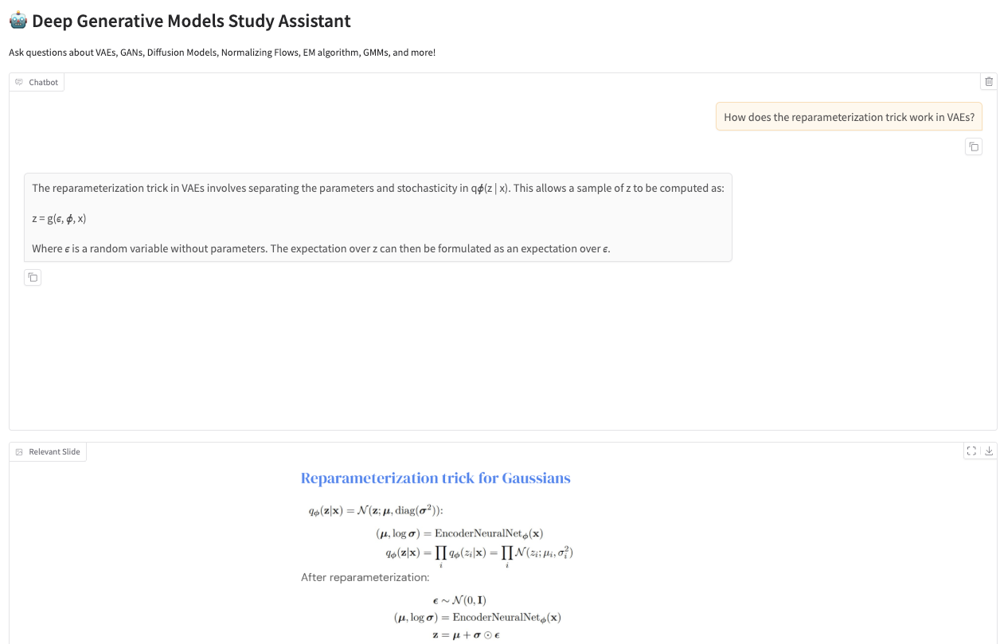

# Deep Generative Models Study Assistant


DGM Study Assistant is a Retrieval-Augmented Generation (RAG) system designed to help students learn Deep Generative Models. It retrieves information from course slides and transcripts, providing accurate answers with source citations.

The assistant can explain concepts, answer questions, and help with topics related to:
* Variational Autoencoders (VAEs) and the reparameterization trick
* Generative Adversarial Networks (GANs)
* Diffusion Models and denoising processes
* Normalizing Flows and change of variables
* Expectation–Maximization (EM) algorithm
* Gaussian Mixture Models (GMMs)
* Evidence Lower Bound (ELBO) and variational inference



## Features
- **Accurate Answers**: Uses llama3.2:3b model for better reasoning
- **Source Citations**: Every answer includes slide/page references
- **Direct Quotes**: Extracts key definitions directly from course materials
- **Chat Interface**: Clean, conversational UI with message history
- **Slide Viewer**: Shows relevant slides alongside answers
- **Evaluation Tools**: Built-in metrics to assess answer quality

🧪 **RAG Evaluation**  
See the detailed evaluation documentation here:  
[src/dgm_study_assistant/evaluation/README.md](src/dgm_study_assistant/evaluation/README.md)

## Installation 
**Install uv**

uv is a fast Python package and environment manager that replaces pip, venv, and pip-tools.
macOS & Linux: 

`curl -LsSf https://astral.sh/uv/install.sh | sh`

Then reload your shell: 

`source ~/.zshrc  # or ~/.bashrc`

macOS (Homebrew alternative):

`brew install uv`

Windows (PowerShell):

`powershell -c "irm https://astral.sh/uv/install.ps1 | iex"`

Verify Installation:

`uv --version`

**Create and activate virtual environment**
```
uv venv
source .venv/bin/activate  # or .venv\Scripts\activate on Windows
```

**Install project**

`uv pip install -e .`

**Copy environment template**

`cp .env.example .env`

**Run Gradio app**

`uv run ui/app.py`

## Recent Updates

### Improved Answer Quality
- Upgraded to llama3.2:3b model for better understanding of technical concepts
- Enhanced prompt engineering to extract direct quotes and provide clear explanations
- Fixed transcript loading to handle various text encodings

### Better User Experience
- Fixed chat history to show proper conversation flow
- Optimized answer length for concise yet complete responses
- Improved source citation format with slide/page references

### Code Cleanup
- Removed unused advanced retrieval components
- Simplified the codebase while maintaining performance
- Streamlined the RAG pipeline for better maintainability

## Quick Start

1. Make sure Ollama is installed and running
2. Pull the required model: `ollama pull llama3.2:3b`
3. Pull the embedding model: `ollama pull nomic-embed-text`
4. Run the app: `uv run ui/app.py`
5. Open http://localhost:7860 in your browser

## Tips for Best Results

- Be specific in your questions (e.g., "How does the reparameterization trick work in VAEs?")
- Enable evaluation mode to see answer quality metrics
- Click on recommended questions for examples
- Use the slide viewer to see visual context alongside answers
