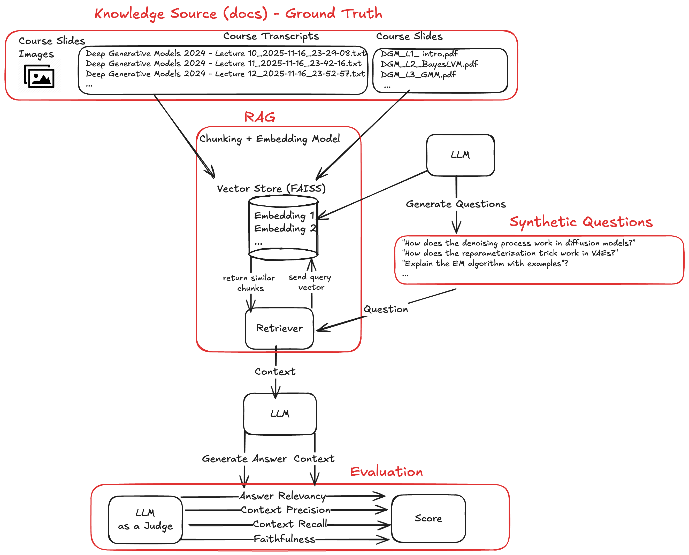
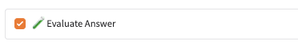

# RAG Evaluation

This folder contains a small CLI and helpers for evaluating the Study Assistant RAG pipeline using RAGAS.

It focuses on synthetic evaluation (SDG): generate questions from your own documents, run your RAG system, then score.




## Prerequisites

- A built FAISS index at `faiss_index/` in the repository root.
- A working LLM + embedding configuration (from your normal app settings).

## Usage

Evaluate the answer directly in the UI by toggling the evaluation button:



Or Run from the repository root.

### Synthetic evaluation

```bash
uv run src/dgm_study_assistant/evaluation/evaluate_rag.py -n 10 --save-results evaluation_results_synth.json
```

Optionally save and reuse a generated synthetic set:

```bash
uv run src/dgm_study_assistant/evaluation/evaluate_rag.py -n 15 --save-synthetic synthetic_data.json --save-results results.json
uv run src/dgm_study_assistant/evaluation/evaluate_rag.py --load-synthetic synthetic_data.json --save-results results_rerun.json
```

### Single question

```bash
uv run src/dgm_study_assistant/evaluation/evaluate_rag.py --question "What is the ELBO in variational autoencoders?"
```

## CLI options

| Option | Description | Default |
|--------|-------------|---------|
| `--samples`, `-n` | synthetic samples to generate | 10 |
| `--save-synthetic` | save synthetic dataset to JSON | None |
| `--load-synthetic` | load an existing synthetic dataset JSON | None |
| `--save-results` | save evaluation results JSON | `evaluation_results.json` |
| `--question`, `-q` | run a single question instead of a dataset | None |

## Metrics

The evaluator currently computes these RAGAS metrics:

- Context Recall
- Faithfulness
- Answer Relevancy
- Context Precision

The CLI prints per-metric mean/std across samples and a simple weighted overall score.

## Example output

```
DGM Study Assistant - RAGAS Evaluation
==================================================
Custom RAGAS implementation with domain-specific metrics

Using LLM: ollama/granite4:micro
Using embeddings: nomic-embed-text
Loading RAG system...

Generating synthetic dataset with 10 samples...
Loading 50 documents for DGM-focused synthetic generation
Successfully generated 10 synthetic samples

Running RAGAS evaluation...
Evaluation completed!
Overall Score: 0.742
Context Recall: 0.850
Faithfulness: 0.721
Answer Relevancy: 0.698
Context Precision: 0.702

Evaluation completed successfully.
Results saved to: evaluation_results.json
Good RAG performance with room for improvement.
```

## Troubleshooting

### Common issues

**FAISS index not found**:
```bash
# Make sure the FAISS index exists at: ./faiss_index/index.faiss
```

**Import errors**:

- Run from the repository root.
- Use `uv run ...` (or ensure `PYTHONPATH` includes `./src`).

**Slow runs**:

- Start with small numbers (`-n 3` / `--hf-samples 3`) and scale up.

**LLM not responding**:

- Check that your configured provider is available (for Ollama, that the server is running and the model is pulled).
